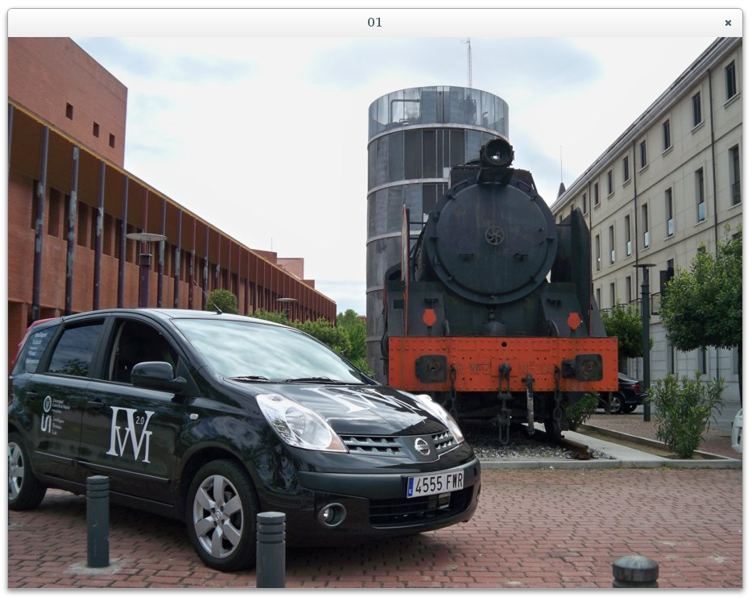

# Carga de imagen



## Clase cv::Mat

Matriz que sirve para representar una imagen.

```
class CV_EXPORTS Mat
{
public:

    
    /*! includes several bit-fields:
         - the magic signature
         - continuity flag
         - depth
         - number of channels
     */
    int flags;

    //! the array dimensionality, >= 2
    int dims;

    //! the number of rows and columns or (-1, -1) when more than 2 dimensions
    int rows, cols;

    //! pointer to the data
    uchar* data;

    //! pointer to the reference counter;
    // when array points to user-allocated data, the pointer is NULL
    int* refcount;

    //! returns true if matrix data is NULL
    bool empty() const;
    
    
};
```

## cv::imread()

Devuelve un objeto de clase Mat con la imagen cargada en memoria desde un fichero.

    Mat imread(const String& filename, int flags = IMREAD_COLOR)

Usando flags se puede forzar a almacenar la imagen en memoria con determinada paleta de colores.
```
enum {
    IMREAD_UNCHANGED  = -1, // 8bit, color or not
    IMREAD_GRAYSCALE  = 0,  // 8bit, gray
    IMREAD_COLOR      = 1,  // unchanged depth, color
    IMREAD_ANYDEPTH   = 2,  // any depth, unchanged color
    IMREAD_ANYCOLOR   = 4   // unchanged depth, any color
};
```

Después de la carga se comprueba si la operación ha tenido éxito con el método _Mat::empty()_:
```
    // cargar la imagen y comprobar que lo ha hecho correctamente
    cv::Mat imagen = cv::imread("fichero.jpg");
    if (imagen.empty()) {
        cout << "Error al cargar la imagen." << endl;
        return 1;
    }
```

## cv::imshow()

Crea una ventana con un nombre y visualiza una imagen desde memoria.

    void imshow(const String& winame, InputArray mat)

Ejemplo:
```
    // mostrar la imagen
    cv::imshow("01", imagen);
```
