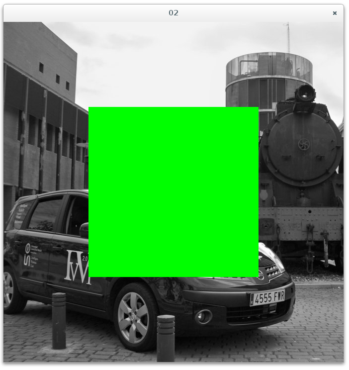

# Acceso a pixels



## Clase cv::Vec

Representa un vector (matriz unidimensional) parametrizable con el tipo (_Tp) y 
el número (n) de los elementos. 

Hay predefinidos tipos _VecNt_ donde N es el número de elementos y t es el tipo 
básico de elemento (b=byte, s=short, i=int, f=float, d=double).

_Vec3b_ es usado para definir las 3 componentes RGB de un pixel.

Se usa el operador _[]_ para acceder a los elementos del vector.

```
template<typename _Tp, int n> class Vec : public Matx<_Tp, n, 1> {...};

typedef Vec<uchar, 2> Vec2b; // 2 uint8_t
typedef Vec<uchar, 3> Vec3b; // 3 uint8_t
typedef Vec<uchar, 4> Vec4b; // 4 uint8_t

typedef Vec<short, 2> Vec2s; // 2 int16_t
typedef Vec<short, 3> Vec3s; // 3 int16_t
typedef Vec<short, 4> Vec4s; // 4 int16_t

typedef Vec<int, 2> Vec2i; // 2 int32_t
typedef Vec<int, 3> Vec3i; // 3 int32_t
typedef Vec<int, 4> Vec4i; // 4 int32_t

typedef Vec<float, 2> Vec2f; // 2 float
typedef Vec<float, 3> Vec3f; // 3 float
typedef Vec<float, 4> Vec4f; // 4 float
typedef Vec<float, 6> Vec6f; // 6 float

typedef Vec<double, 2> Vec2d; // 2 double
typedef Vec<double, 3> Vec3d; // 3 double
typedef Vec<double, 4> Vec4d; // 4 double
typedef Vec<double, 6> Vec6d; // 6 double
```

## cv::Point_

Define un punto en el espacio 2D con sus 2 componentes _x_ e _y_ que pueden ser de tipo numérico.

Expone las propiedades _Point::x_ y _Point::y_ para el acceso a las componentes.

El tipo _Point_ es un alias a _Point2i_ (punto definido por componentes de tipo int).

```
template<typename _Tp> class Point_ { ... }

typedef Point_<int> Point2i;     // 2 int 
typedef Point_<float> Point2f;   // 2 float
typedef Point_<double> Point2d;  // 2 double

typedef Point2i Point;
```

Están las versiones para puntos 3D con los alias para int (Point3i), float (Point3f) y double (Point3d):

```
template<typename _Tp> class Point3_ { ... }

typedef Point3_<int> Point3i;    // 3 int
typedef Point3_<float> Point3f;  // 3 float
typedef Point3_<double> Point3d; // 3 double
```


## Mat::at()

Obtiene la referencia a un pixel de la imagen para leerlo o modificarlo.

   Vec<_Tp,n>& Mat::at(const Point_<_Tp>& idx);

Es más intuitivo utilizar el operador _( x, y )_ que está escrito para los tipos int, float y double:

```
```

