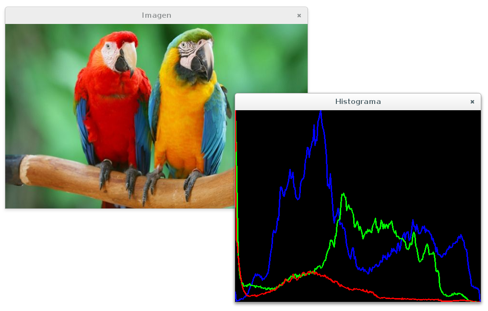

# Histograma



El histograma contiene el __número de pixeles que tienen el mismo nivel de gris__ (o de una componente de color si la imagen es compuesta). Puede entenderse como la probabilidad de que un valor de gris determinado aparezca en la imagen. 

Tiene la gran ventaja que condensa la información de la imagen en muchos menos valores ( 256 si cada pixel son 8 bits). POr contra, no aporta ninguna información sobre la localización espacial de los pixeles.

## cv::split()

The functions split split a multi-channel array into separate single-channel
arrays.

```
void cv::split (
    InputArray m,               // input multi-channel array
    OutputArrayOfArrays mv      // output array
)
```


## cv::calcHist()

Calculate the histogram of one or more arrays. The elements of a tuple used to
increment a histogram bin are taken from the corresponding input arrays at the
same location

```
void cv::calcHist(
    calcHistInputArrayOfArrays images,    // source arrays
    const std::vector< int > & channels,  // list of the channels
    InputArray mask,                      // optional mask
    OutputArray hist,                     // output histogram
    const std::vector< int > & histSize,  // histogram sizes in each dimension
    const std::vector< float > & ranges,  // dims arrays of the histogram bin boundaries
    bool accumulate = false               // histogram is not cleared
)
```


## cv::normalize()

Normalizes the norm or value range of an array.

```
void normalize (
    InputArray src,             // input array
    OutputArray dst,            // output array of the same size as src
    double alpha = 1,           // norm value to normalize to or the lower range boundary
    double beta = 0,            // upper range boundary
    int norm_type = NORM_L2,    // normalization type
    int dtype = -1,             // when negative, the output array has the same type as src
    InputArray mask = noArray() // optional operation mask
)
```


## cv::Scalar

Template class for a 4-element vector derived from Vec.

```
template<typename _Tp> class cv::Scalar_< _Tp >

typedef Scalar_<double> cv::Scalar

```


## cv::line()

Draws a line segment connecting two points.

```
void cv::line (
    lineInputOutputArray img,  // image
    Point pt1,                 // first point
    Point pt2,                 // second point
    const Scalar &color,       // line color
    int thickness = 1,         // line thickness
    int lineType = LINE_8,     // type of the line
    int shift = 0              // fractional bits in the point coordinates
)

enum cv::LineTypes {
    FILLED,    // filled line
    LINE_4,    // 4-connected line
    LINE_8,    // 8-connected line
    LINE_AA    // antialiased line
}

```

## cvRound()

Rounds floating-point number to the nearest integer.

    int cvRound(cvRound float value)
    int cvRound(cvRound double value)

