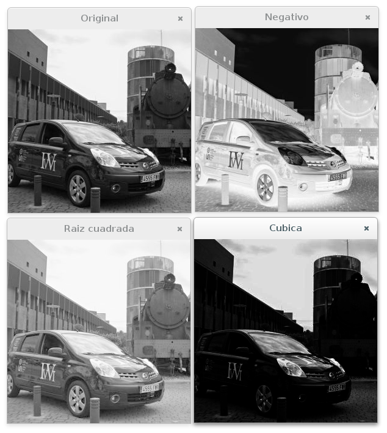

# Look-up tables



##  cv::LUT

Performs a look-up table transform of an array.

```
void LUT(
    InputArray src,        // source array
    InputArray lut,        // look-up table
    OutputArray dst        // destination array
)
```

